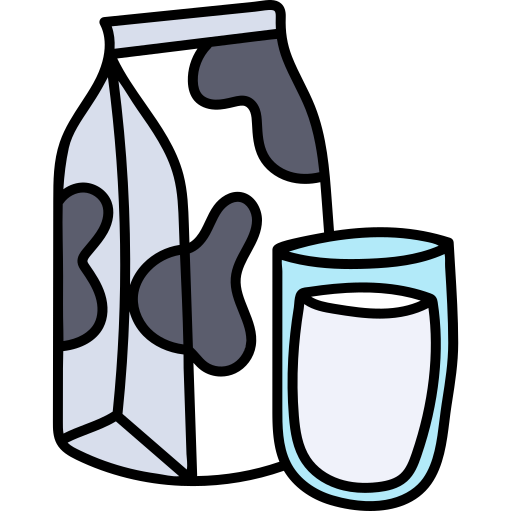
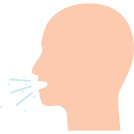
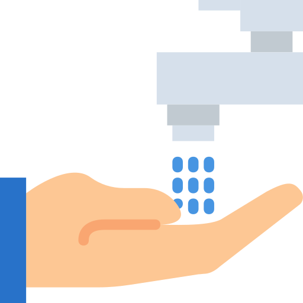
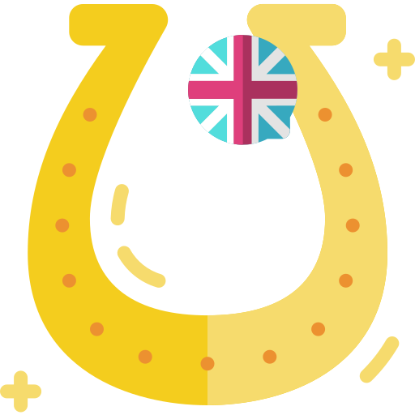
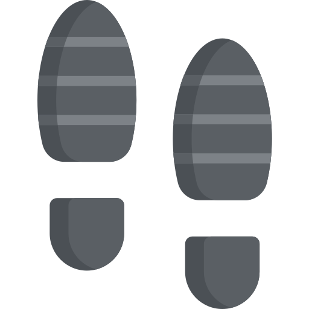
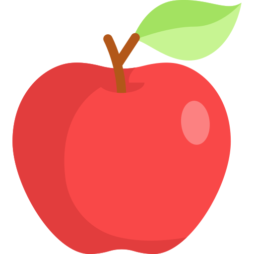

# La fête au Louvre

Weekend du 01/12/2018 rédigé par Phao.

## Informations

### Adresse

Voie des Chanoines 29, 4621 Fléron

## Thème

Pour fêter la nomination de La Jeune Fille à la perle en tant que plus beau tableau de jeune fille du monde, les œuvres d'art du monde entier se rassemblent au Louvre.

## Programme

#### Vendredi
* **19:00** - Arrivée au gîte
* **20:00** - Arrivée des animés
* **21:00** - Soirée karaoké et just-dance
* **23:00** - Coucher

#### Samedi

* **08:00** - Lever et gym
* **09:00** - Déjeuner (Céréales) puis vaisselle
* **10:00** - Jeu du matin
* **12:00** - Diner (Dagoberts) puis vaisselle
* **13:00** - Jeu de l'après-midi
* **17:00** - Temps-libre et/ou sieste
* **18:00** - Souper (Pâtes Carbonara) puis vaisselle
* **19:30** - Soirée blind-test
* **21:30** - Jeu de nuit
* **23:00** - Coucher

#### Dimanche

* **08:00** - Lever, gym et rangement des sacs
* **09:00** - Déjeuner (Céréales) puis vaisselle
* **10:00** - Rangement du gîte
* **11:00** - Départ des animés
* **12:00** - Nettoyage du gîte
* **13:00** - Retour au local

## Courses

#### Céréales

* 12 × Une brique de lait
* 4 × Une boîte de "Choco Pops"
* 3 × Une boîte de "Honey Pops"

#### Dagoberts

* 8 × Un paquet de 200g de jambon
* 7 × Un paquet de 500g de fromage en tranche
* 2 × Une boule de laitue
* 2 × Un paquet de 1kg de tomates
* 4 × Un pot de 500ml de mayonnaise
* 1 × Un pot de 1.5kg ketchup

#### Pâtes Carbonara

* 2 × Un sachet de 1kg de fromage râpé
* 10 × Une paquet de 500g de penne
* 2 × Une brique de 1L de crème fouettable
* 40 × Un dessert Liégois

#### Autres

* 40 × Une pomme
* 3 × Un paquet de 1kg de mandarines
* 120 × Une mignonette de chocolat
* 6 × Une bouteille de grenadine

## Activités

### Karaoké

C'est la fête ! Un karaoké et un Just-Dance sont organisés.

#### Matériel

* 1 × Un projecteur
* 1 × Un ordinateur
* 1 × Un adaptateur VGA et/ou HDMI
* 1 × Un baffle

### Coupable

La Jeune Fille sans perle se rend compte qu'on lui a volé sa perle. Les œuvres d'art se mettent à la recherche du coupable, en éliminant une à une les salles du Louvre où il peut se trouver. À la fin, la seule salle restante est celle de La Joconde.

#### Explication

Par petit groupes, les animés effectuent des épreuves qui leur permettent d'éliminer une salle sur la carte de Louvre. Le jeu se termine lorsqu'il n'en reste plus qu'une.

#### Matériel

* 1 × Un plan du Louvre
* 1 × Une liste de suspects
* 1 × Un feutre
* 1 × Un jeu de cartes
* 1 × Un bloc de feuilles
* 10 × Un crayon
* 5 × Un aliment incongru
* 5 × Un aliment odorant
* 1 × Un puzzle
* 1 × Un baffle

#### Épreuves

* Origami
* Réaliser un château de cartes de x étages.
* Pictionnary
* Banquise
* Créer une danse.
* Kim-Goût
* Kim-Odeur
* Terminer un puzzle
* Mimer et faire deviner un objet ou une action imposée.
* Trouver et chanter une chanson contenant un mot imposé.
* Réaliser une table à huit pieds et aucune main.
* Réaliser une pile de x chaussures

### Jardins

La Joconde ayant refusé de la rendre, les œuvres d'art se rendent chez elle pour rechercher la perle. Malheureusement, perdues dans les jardins gigantesques, elles sont bien incapables de trouver le bijou. Prise de pitié, La Joconde leur propose un marché : s'ils terminent tous les défis de sa liste avant la fin du temps imparti, elle rendra la perle à La Jeune Fille sans perle.

#### Explication

Les animés se dirigent vers le parc en suivant les indications données sous forme de rébus. Arrivés sur place, ils ont champ libre pendant un court laps de temps pour trouver la perle, qui n'est même pas dans la plaine. Après qu'ils soient revenu, le compte à rebours est lancé et les animés ont champ libre pour réaliser tous les défis.

#### Trajet

	
	
	
	
	
	
	

> Longez les tombes dos au Christ.

	
	
	
	

> La voie est communiste.

	
	
	

> Avancez tout droit.

	
	
	
	
	

> Sauvez la princesse.

	
	
	
	
	

> Le crayon pointe le chemin.

	
	
	
	
	
	

> À gauche au croissant de Noël.

	
	

> Pas à droite.

	
	
	
	

> Courez vers l'Eden.

#### Défis

* Apporter *x* objets rouges n'étant pas des vêtements.
* Apporter *x* feuilles différentes.
* Apporter *x* grains de sable.
* Apporter *x* objets insolites.
* Apporter un trèfle à quatre feuilles.
* Réaliser une croix scoute en brelage.
* Construire une couronne en branche et en herbe.
* Réaliser un jardin japonais.
* Écrire un poème.
* Écrire une chanson avec le nom des œuvres des chefs.
* Réussir une dictée.
* Réciter, de concert, l'alphabet à l'envers.
* Reconnaître et nommer *x* symboles.
* Citer *x* noms de tableaux.
* Citer *x* noms d'animaux.
* Citer *x* personnages du livre de la Jungle.
* Citer *x* dieux grecs.
* Trouver *x* animés sachant faire quelque chose d'inhabituel avec leur corps.
* Jeu des questions.
* Un animé et une animée échangent leur habits.
* Déguiser quelqu'un en momie sans casser le rouleau de papier.
* Faire un massage à un animateur.
* Faire un bras de fer avec un animateur
* Faire plus de pompes en cumulé qu'un animateur.
* Descendre la tyrolienne sans aucun cri.

### Blind Test

La Jeune Fille à la perle ayant retrouvé son bijou, c'est une nouvelle occasion de faire la fête avec un blind-test. Cependant, pendant la soirée un étrange phénomène se produit : les œuvres d'art disparaissent une à une.

#### Explication

Jeu de nuit : les animés doivent suivre, seul et les yeux bandés, un fil d'Ariane. Le chemin est parsemé d'obstacles et les animateurs tentent d'effrayer les animés en les touchant où en faisant du bruit.

#### Matériel

* 1 × Une bobine de corde

## Ressources

### Impressions

* Plan du Louvre - [map.pdf](resources/pdf/map.pdf)
* Liste des suspects - [list.pdf](resources/pdf/list.pdf)
* Itinéraire - [map.jpg](resources/jpg/map.jpg)

### Vidéos

* Ensemble on est mieux - [https://www.youtube.com/watch?v=83E2dEj1KPA](https://www.youtube.com/watch?v=83E2dEj1KPA)

## Remarques

### Courses

Pour 22 animés et 8 animateurs, il restait beaucoup de fromage, mayonnaise, mandarines, pâtes et grenadine. À l'inverse il ne restait pas ou peu de lait et de céréales.

### Karaoké

Les animés n'ont pas apprécié la playlist.

### Jardins

Les animés ont aimé les rébus mais le parc était fermé.
