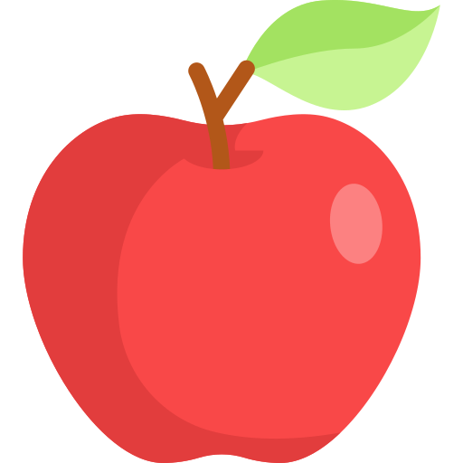
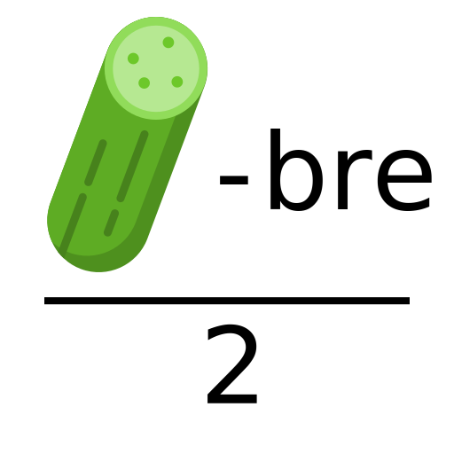
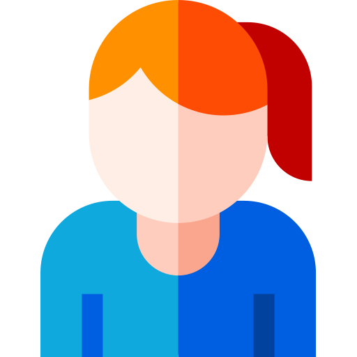

# Le retour aux dortoirs

Jeu du 23/07/2019 rédigé par Akela.

## Thème

Poudlard est une école aux milles secrets que les élèves n'ont pas encore décrypté. Pour la première fois, ils sont livrés à eux-mêmes pour retourner à leurs dortoirs. Mais ils ne sont pas à l'abri de quelques soucis. Ils risquent de rencontrer trolls, fantômes, être confrontés à des tableaux réticents et à subir les aléas des escaliers mouvants.

## Matériel

* 2 × Un dé truqué
* 2 × Un dé
* 1 × Une paille
* 1 × Un bic
* 1 × Un bloc de feuilles
* 4 × Une balle
* 1 × Un casque / une paire d'écouteurs

## Jeu

Chaque maison doit retrouver le tableau de son fondateur pour obtenir le mot de passe. Ensuite elle doit retrouver la bonne grosse dame qui surveille son dortoir.

Le plateau est découvert progressivement. Il existe plusieurs types de cases. Les cases fantômes qui font revenir à l'endroit de départ du tour. Les cases troll, il faut vaincre le troll grâce aux dés, si un membre de la maison fait plus que 8 avec 2 deux, il réussi à lancer sa baguette dans le nez du troll, il faut 3 réussite, chaque élève ayant un essai. Les cartes tableaux, il faut répondre à une question sur les tableaux affichés dans la grande salle. Les cases couloir où il faut réussir une épreuve. Les cases escaliers qui les transportent à un endroit aléatoire. Les cases murs qui indiquent un cul de sac. Et finalement les cases fondateurs et dortoirs. Pour trouver le mot de passe, il faut décrypter un rébus caché près du tableau du fondateur dans la grande salle.

Pour avancer dans le château, chaque maison lance les dés, ils ont droit à 2 dés si l'épreuve est réussie et à 1 seul dans le cas contraire. Les dés utilisés ont 4 faces de 1 et 2 faces de 0.

### Épreuves couloir

* Transporter de l'eau d'un verre à l'autre grâce à une paille
* Pictionnary
* Mini-scènes sur Harry Potter
* Pyramide
* Ils s'entre-mêlent et doivent se démêler
* Retrouver un objet au toucher
* Memory d'objet sous un drap
* Torpille (objet au sol)
* Dessin sur le sol
* Marcher 10m en ligne droite
* Course-relais
* 5 feuilles d'arbres différents
* Jongles
* Casque et musique
* 4 pieds et 3 mains

### Cases tableau

Qui s'appuie sur une canne ?

> La dame en rose

Qui porte un collier de perles ?

> La dame en rose

Qui porte des sandales ?

> La grosse dame

Quelle est la couleur des fleures derrière la grosse dame ?

> Rose

Combien de bracelets porte la grosse dame ?

> 2

Qui est en Grèce ?

> La grosse dame

Qui est la mieux maquillée ?

> La grosse dame

Combien d'animaux sur le tableau de la dame à la licorne ?

> 17

Où se trouve le coffre ?

> Avec la dame à la licorne

Où se trouve la phrase "mon seul désir" ?

> Avec la dame à la licorne

Où se trouve le coussin ?

> Avec la dame à la licorne

Combien de meurtrières visibles derrière Godric ?

> 63

Quel est le nombre de tableaux avec Poudlard visible ?

> 4

Sur quel tableau peut-on voir la fleur des scouts / de lys ?

> Dumbledore

Sur quel tableau voit-on une épée ?

> Griffondor

Sur quel tableau voit-on un diadème ?

> Serdaigle

Combien de tours sont visibles sur l'ensemble des tableaux ?

> 17

Quelle est la devise de Poudlard ?

> Ne chatouille pas un dragon qui dort

Qui paraît le plus alcoolo ?

> Poufsouffle

Quel animal représente Serdaigle ?

> Aigle

Qui a le plus de bijoux ?

> Serpentard

Où voit-on un chat ?

> La dame au chat

Où voit-on une fenêtre ?

> La dame au chat

Qui porte un chapeau de sorcier ?

> La dame au chat

Qui a des pinceaux ?

> Gilderoy Lockhart

Qui se trouve le plus beau ?

> Gilderoy Lockhart

Citer les 4 animaux de maison

> Aigle, griffon, serpent et blaireau

### Mots de passe

	
	
	
	
	
	
	
	
	
	
	

> Sorbet de citron et sa crème vanille

	
	
	
	
	
	
	
	
	
	
	

> Fondant au chocolat et sa crème anglaise

	
	
	
	
	
	
	
	
	
	

> Tarte aux pommes et boule de glace caramel

	
	
	
	
	
	
	
	
	
	

> Tiramisu accompagné de fruits rouges

## Ressources

### Impressions

* Plateau - [map.pdf](resources/pdf/map.pdf)
* Cases spéciales - [special.pdf](resources/pdf/special.pdf)
* Mimi Geignarde - [mimi.pdf](resources/pdf/mimi.pdf)
* Escalier - [stairs.pdf](resources/pdf/stairs.pdf)
* Cul de sac - [wall.pdf](resources/pdf/wall.pdf)
* Troll - [troll.pdf](resources/pdf/troll.pdf)
* Cadre - [frame.pdf](resources/pdf/frame.pdf)

### Tableaux

* Albus Dumbledore endormi - [albus_dumbledore.jpg](resources/jpg/albus_dumbledore.jpg)
* La dame au chat - [dame_chat.jpg](resources/jpg/dame_chat.jpg)
* La dame à la licorne - [dame_licorne.jpg](resources/jpg/dame_licorne.jpg)
* La dame en rose - [dame_rose.jpg](resources/jpg/dame_rose.jpg)
* Elga Poufsouffle - [elga_poufsouffle.jpg](resources/jpg/elga_poufsouffle.jpg)
* Gilderoy Lockhart peignant Gilderoy Lockhart - [gilderoy_lockhart.png](resources/png/gilderoy_lockhart.png)
* Godric Gryffondor - [godric_gryffondor.jpg](resources/jpg/godric_gryffondor.jpg)
* La grosse dame - [grosse_dame.png](resources/png/grosse_dame.png)
* Phineas Black - [phineas_black_1.jpg](resources/jpg/phineas_black_1.jpg)
* Phineas Black endormi - [phineas_black_2.png](resources/png/phineas_black_2.png)
* Le blason de Poudlard - [poudlard.jpg](resources/jpg/poudlard.jpg)
* Rowena Serdaigle - [rowena_serdaigle.jpg](resources/jpg/rowena_serdaigle.jpg)
* Salazar Serpentard - [salazar_serpentard.jpg](resources/jpg/salazar_serpentard.jpg)
